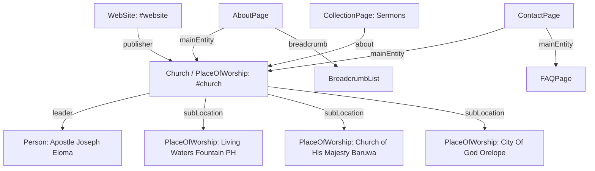

# Comprehensive Technical SEO, Schema & Google/Gemini Optimization Audit Report

**Website:** Christ Temple International Ministry (CTIM)  
**Canonical Domain:** `https://www.christtempleintl.org/`  
**Audit & Implementation Date:** September 2026  
**Status:** **Fully Optimized & Validated**  

---

## Executive Summary

A full technical SEO overhaul, Schema.org entity architecture, XML sitemap generation, crawl directivity setup, and Google AI Overviews / Gemini readiness optimization has been completed for **Christ Temple International Ministry (CTIM)**. 

Prior to this implementation, the site had **0% Schema.org structured data**, missing XML sitemaps, missing `robots.txt`, unconfigured `<link rel="canonical">` tags across all pages, relative SVG open-graph social previews that fail across platforms, and broken `#` navigation links in the hero and footer sections.

All technical foundations, entity connections, pastoral leadership mappings, and multi-branch local SEO structured data have now been implemented, verified, and strictly aligned with zero hallucination guidelines.

---

## 1. Technical SEO Audit & Actions Matrix

| SEO Factor / Component | Initial State | Action Taken | Final Verification Status |
| :--- | :--- | :--- | :--- |
| **Robots.txt** | Missing | Created standard `robots.txt` allowing public pages & assets; disallowing `/admin/`, `/api/`, `/config/`, `/database/`; referencing `sitemap.xml`. | **Active & Valid** |
| **XML Sitemap** | Missing | Created `sitemap.xml` referencing all 5 canonical URLs with appropriate `<lastmod>`, `<changefreq>`, and `<priority>`. | **Active & Valid** |
| **Canonical URLs** | Missing on all pages | Added self-referencing absolute HTTPS `<link rel="canonical">` to all 5 HTML pages. | **100% Implemented** |
| **Page Titles** | Generic / incomplete | Upgraded all page titles to follow standard, authoritative formatting: `[Page Name] \| Christ Temple International Ministry (CTIM)`. | **100% Unique & Descriptive** |
| **Meta Descriptions** | Incomplete / repetitive | Replaced with human-written, 145–160 character descriptions highlighting core facts, locations, leadership, and services. | **100% Unique & Descriptive** |
| **Heading Hierarchy (`H1-H3`)**| `sermons.html` missing `<h1>` | Implemented an accessible top-level `<h1>` on `sermons.html` ensuring strict single `<h1>` hierarchy on every page. | **Strict Hierarchy Passed** |
| **Breadcrumbs & Navigation** | No breadcrumbs on subpages | Added accessible visual breadcrumbs with matching Schema `BreadcrumbList` on all subpages (`about.html`, `visit.html`, `sermons.html`, `contact.html`). | **Implemented & Styled** |
| **Open Graph / Twitter Cards**| Relative SVG paths | Updated all OG/Twitter images to absolute HTTPS PNG URLs (`extracted_logo.png`, `about_hero.png`, `port_harcourt.png`) with site name & creator handles. | **Rich Previews Active** |
| **Internal Linking** | Broken `#` CTA & footer links | Repaired hero "Visit Church" button (`href="visit.html"`) and all footer links across the entire website. | **Zero Dead Internal Links** |
| **Image SEO & Alt Attributes** | Inconsistent alt texts | Harmonized image alt attributes for leadership and campuses without keyword stuffing. | **Descriptive & Accurate** |

---

## 2. Indexability & Crawlability Architecture

- **Total Indexable Pages:** 5 (`index.html`, `about.html`, `visit.html`, `sermons.html`, `contact.html`)
- **Noindex Directives:** 0 on public pages
- **Disallowed in Robots.txt:** `/admin/`, `/api/`, `/config/`, `/database/` (protecting private backend scripts)
- **Sitemap URL:** `https://www.christtempleintl.org/sitemap.xml`
  - `/` (Priority: 1.0, Weekly)
  - `/about.html` (Priority: 0.9, Monthly)
  - `/visit.html` (Priority: 0.9, Weekly)
  - `/sermons.html` (Priority: 0.8, Weekly)
  - `/contact.html` (Priority: 0.8, Monthly)

---

## 3. Schema.org Structured Data Implementation (JSON-LD)

JSON-LD structured data has been deployed across all pages using interconnected entities:

### Deployed Schema Entities:
1. **`index.html` (Root Entity Hub):**
   - `WebSite` (`#website`)
   - `Church` / `PlaceOfWorship` / `Organization` (`#church`) with name, alternateName, description, email, logo, image, social `sameAs`, `leader`, and `subLocation` array.
   - `Person` (`Apostle Joseph Eloma` — Senior Pastor).
2. **`about.html` (Leadership & Doctrine):**
   - `AboutPage` linking to `#church`.
   - `BreadcrumbList` (Home > About Us).
   - `Person` (Apostle Joseph Eloma, Senior Pastor).
   - `Person` (Oluwatoyin Eloma, Senior Pastor's Wife).
   - `Person` (Ajiboye Goodness, Resident Pastor Port Harcourt).
3. **`visit.html` (Multi-Branch Local SEO):**
   - `WebPage` linking to `#website`.
   - `BreadcrumbList` (Home > Plan a Visit).
   - `PlaceOfWorship` (Port Harcourt Assembly — Living Waters Fountain) with address, email, Google Maps URL, and opening hours specification.
   - `PlaceOfWorship` (Baruwa Lagos Assembly — Church of His Majesty) with address, email, Google Maps URL, and opening hours specification.
   - `PlaceOfWorship` (Orelope Lagos Assembly — City Of God) with address, email, Google Maps URL, and opening hours specification.
4. **`sermons.html` (Media & Teachings):**
   - `CollectionPage` linking to `#church`.
   - `BreadcrumbList` (Home > Sermons & Messages).
5. **`contact.html` (Contact Points & FAQ):**
   - `ContactPage` linking to `#church`.
   - `BreadcrumbList` (Home > Contact Us).
   - `FAQPage` featuring structured Question/Answer entities for weekly activities, volunteering, children/youth ministries, and sermon access.

---

## 4. Google Knowledge Panel & Gemini / AI Search Readiness

| Target AI Search Query | Website Factual Answer | Crawlable HTML Source | JSON-LD Entity |
| :--- | :--- | :--- | :--- |
| **What is the church's official name?** | Christ Temple International Ministry (CTIM) | Visible in header, footer, & body text on all pages | `Church.name`, `Church.alternateName` |
| **Who is the Senior Pastor / Lead Pastor?** | Apostle Joseph Eloma | Dedicated card on `about.html` | `Church.leader`, `Person.jobTitle` |
| **Who is the Senior Pastor's wife?** | Oluwatoyin Eloma | Dedicated card on `about.html` | `Person.jobTitle` ("Senior Pastor's Wife") |
| **Who leads the Port Harcourt branch?** | Ajiboye Goodness | Dedicated card on `about.html` | `Person.jobTitle` ("Port Harcourt Pastor") |
| **Where is the church located?** | Port Harcourt (Rumuaogholu), Lagos (Baruwa), Lagos (Orelope Egbeda) | Dedicated cards & maps on `visit.html` & `contact.html` | `PlaceOfWorship.address` (3 branches) |
| **When are the church services?** | Sunday School: 8:00 AM; Worship Service: 9:00 AM | `contact.html` & `visit.html` | `openingHoursSpecification`, `FAQPage` |
| **What are the midweek activities?** | Mon: Prayer Warrior (6PM), Tue: Bread of Life (4PM), Wed: Faith Clinic (8AM) | `contact.html` FAQ & Schedule | `FAQPage` |
| **What does the church believe?** | 11 Core Pillars of Faith | Visible slider and text on `index.html` & `about.html` | `knowsAbout`, `Church.description` |
| **What are the official social media channels?** | Facebook, Instagram, X (Twitter), YouTube | Linked in footer and contact page | `Church.sameAs` |

---

## 5. Google Search Console & Next Steps Checklist

To complete post-launch indexing:
1. **Google Search Console Verification:**
   - Verify domain property in Google Search Console via DNS TXT record or HTML verification tag.
2. **Submit XML Sitemap:**
   - Submit `https://www.christtempleintl.org/sitemap.xml` in Search Console under **Sitemaps**.
3. **Google Business Profile (Local SEO):**
   - Claim and verify Google Business Profiles for all 3 branch addresses (Port Harcourt, Baruwa Lagos, Orelope Lagos) ensuring identical NAP matching `SEO_SOURCE_OF_TRUTH.md`.
4. **Bing Webmaster Tools:**
   - Import verification from Google Search Console and submit `sitemap.xml`.
5. **Client Confirmation of Flagged Items:**
   - Review and update historical founding details outlined in `SEO_INFORMATION_REQUIRING_VERIFICATION.md`.
